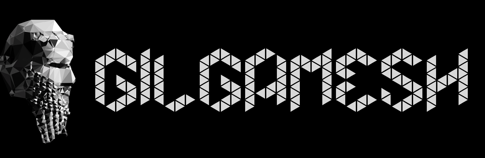

# Gilgamesh



[](https://github.com/BarthPaleologue/Gilgamesh/actions/workflows/rust.yml)
[](https://crates.io/crates/gilgamesh)
[]()

A small 3D WGPU engine written in Rust that does not rely on the ECS pattern.

## Features

- Up to 128 point lights per material
- Up to 128 directional lights per material
- Built-in Phong shading
- Normal mapping
- Procedural mesh generation

## Coming Soon

- Shadow mapping
- PBR shading
- GLTF support


## Getting Started

Here is a quick example of how to use Gilgamesh to render a procedural terrain:

```rust
extern crate gilgamesh;

use gilgamesh::{init_gilgamesh, start_gilgamesh};
use gilgamesh::mesh::Mesh;

fn main() {
    let mut app = init_gilgamesh();

    let sphere = Mesh::new_procedural_sphere(5.0, 32, &|x, y, z| {
        f32::powi(f32::sin(60.0 * x * y * z), 2) / 2.0
    }, 0.5, &mut app.engine);

    app.scene.add_mesh(sphere);

    start_gilgamesh(app);
}
```

## About

Loosely based
on [Dr. Xu youtube series](https://www.youtube.com/watch?v=i6WMfY-XTZE&list=PL_UrKDEhALdJS0VrLPn7dqC5A4W1vCAUT)
and the [WGPU tutorial](https://sotrh.github.io/learn-wgpu/).