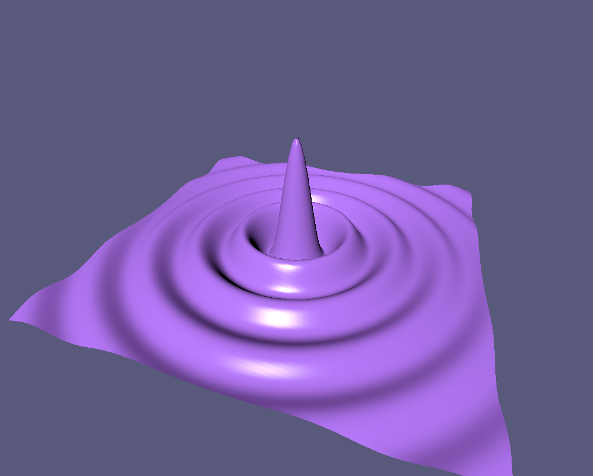

# Gilgamesh

A small 3D rendering engine built upon WGPU with the primary goal of visualizing procedural terrains.

Loosely based on [Dr. Xu youtube series](https://www.youtube.com/watch?v=i6WMfY-XTZE&list=PL_UrKDEhALdJS0VrLPn7dqC5A4W1vCAUT)

